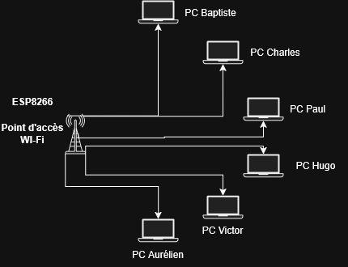

```mermaid
graph TD

    %% Sous-réseau Local
    subgraph LAN ["Réseau Local (192.168.4.0/24)"]
        Switch --> Serveur["PC Serveur Local\n192.168.4.1"]
        Switch --> IoT["Objets IoT\n192.168.4.10 - .29"]
        Switch --> Postes["Postes de l'équipe\n192.168.4.30 - .49"]
    end

```markdown
